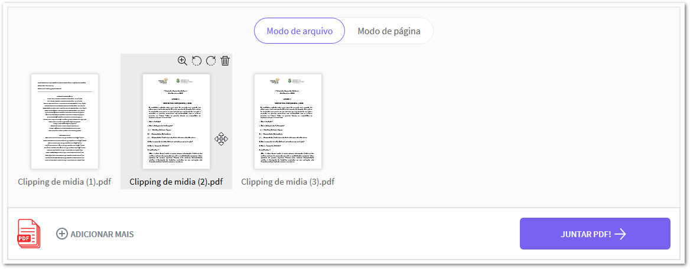

# Como juntar vários arquivos em um só pdf

### Passo a passo

* Acesse o site [https://smallpdf.com/pt/juntar-pdf](https://smallpdf.com/pt/juntar-pdf) e clique em `Escolher arquivo`.

* Selecione no seu computador os aquivos em pdf que serão combinados e clique no botão `Abrir`.
* O sistema irá carregar todos os arquivos que você selecionou. Note que é possível mudar a ordem dos pdf clicando e arrastando. Também aparecerão opções de rotacionar o documento ou excluir, ao passar o mouse em cima.

* Estando tudo ok, clique no botão `JUNTAR PDF!`
* Por fim, basta clicar no botão `BAIXAR` que o arquivo combinado será salvo no seu computador ♥ 

