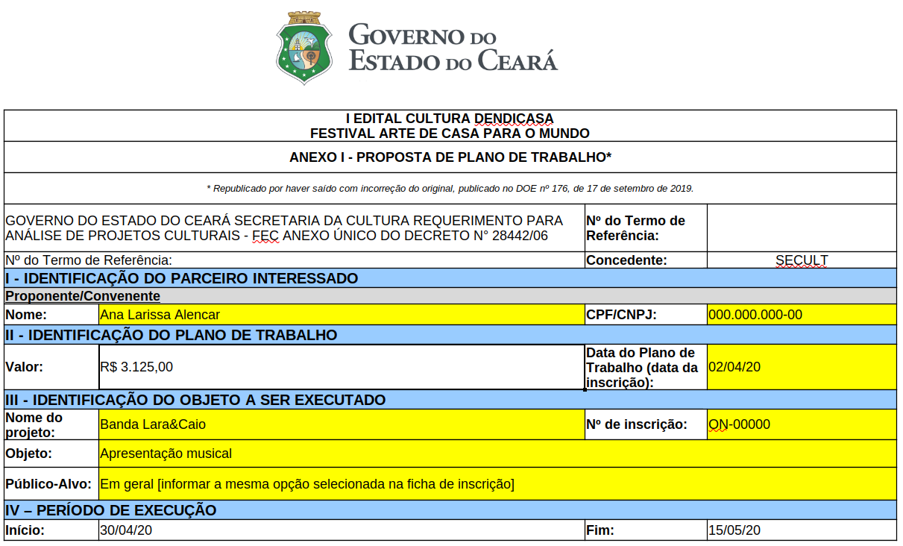
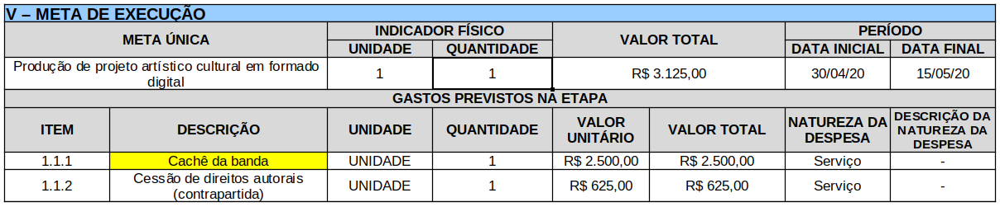
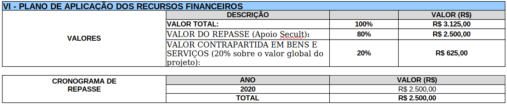
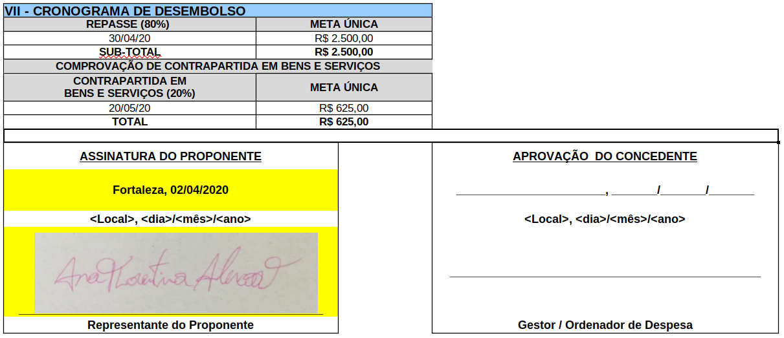

# Modelo de preenchimento do Plano de Trabalho do I Edital Cultura Dendicasa

Olá, nesse minitutorial apresentaremos um modelo de preenchimento do Anexo I \(Plano de Trabalho\) do I Edital Cultura Dendicasa. O plano de trabalho é um instrumento normalmente utilizado em editais mais complexos no qual é preciso detalhar informações sobre metas, etapas e orçamento do projeto. Você pode encontrar um explicação mais detalhada [neste vídeo ▶](https://www.youtube.com/watch?v=ei9F3VqNcas&t).


Houve uma alteração no formato da planilha apresentada no vídeo. Antes o conteúdo do plano de trabalho era dividido em várias abas. O modelo atual juntou todas numa única aba e criou uma capa para a identificação do projeto, conteúdo das planilhas de meta e orçamento permanecem as mesmas.  


Para o [Edital Cultura Dendicasa](http://editais.cultura.ce.gov.br/2020/03/31/cultura-dendicasa/) vamos fazer um preenchimento simplificado onde indicaremos os campos cujo preenchimento é padrão e o que precisa ser customizado.

Neste exemplo vamos simular a inscrição de um grupo de musical que gravou uma apresentação.

📰 [link para baixar o modelo de preenchimento do plano de trabalho](https://mapacultural.secult.ce.gov.br/files/opportunity/1652/modelo_--_anexo_i__-_proposta_de_plano_de_trabalho.xlsx).

### Identificação da proposta

Destacamos de amarelo os campos que precisam ser customizados. Nesta primeira parte, basta preencher as informações de identificação do projeto. Lembrando que o número de inscrição é o indicado na ficha do Mapa Cultural que se inicia com on- XXXX 

### Meta de execução

Basta alterar a descrição 1.1, pois os valores e a forma de contrapartida estão definidos no edital.

### Plano de aplicação dos recursos financeiros

Não é necessário alteração, basta seguir os valores indicados no edital.

### Cronograma de desembolso

Modifique a data e assine. Como no exemplo, você pode utilizar uma assinatura digitalizada e enviar o arquivo no mesmo formato \(Excel ou Open Office\) ou então imprimir e digitalizar o plano de trabalho no formato pdf.

